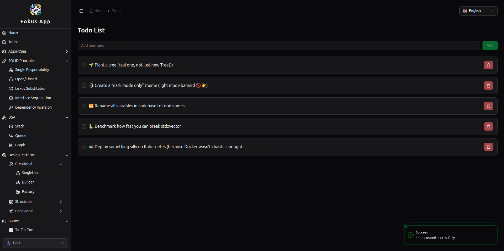

## ✅ Tech Stack Overview

| **Tech**                                 | **Purpose**                                            |
| ---------------------------------------- | ------------------------------------------------------ |
| **React + TypeScript**                   | Frontend UI with strong typing                         |
| **Clean Architecture (MVVM)**            | Maintainable, testable, and decoupled domain structure |
| **ShadCN UI + Tailwind CSS**             | Beautiful modern UI with component primitives          |
| **TanStack Query**                       | Declarative data fetching and caching                  |
| **TanStack Table**                       | Advanced table filtering, sorting, pagination          |
| **Redux Toolkit (optional)**             | Global app state (auth, theme, etc.)                   |
| **Vitest + RTL (React Testing Library)** | Fast and isolated unit/integration testing             |
| **Playwright**                           | End-to-end testing with headless browser automation    |
| **Storybook**                            | Isolated UI component development and documentation    |
| **SonarQube**                            | Static code analysis, coverage tracking, code smells   |
| **Husky + Lint Staged**                  | Git hooks for pre-commit checks (lint, test, format)   |
| **ESLint + Prettier**                    | Code quality, auto formatting                          |
| **Docker**                               | Containerization for local or production deployment    |
| **GitHub Actions**                       | CI: Lint, test, build, and validate PRs                |

---

## 📁 Folder Structure

```
e2e/
├── *.spec.ts
src/
├── core/
│   ├── i18n/                👈 global i18n config lives here
│   │   ├── index.ts          (i18n initialization: react-i18next setup)
│   │   ├── locales/          (global/common translations)
│   │   │   ├── en/
│   │   │   │   ├── common.json
│   │   │   │   └── errors.json
│   │   │   └── de/
│   │   │       ├── common.json
│   │   │       └── errors.json
│   │   └── types.ts          (optional: i18n types for keys)
│   ├── di/
│   ├── error/
│   ├── router/
│   │    ├── routes/
│   │    │   ├── index.ts
│   │    │   └── todos.route.ts
│   │    ├── router.ts
│   │    └── provider.tsx
│   ├── store/
│   │   ├── slices/
│   │   ├── types/
│   │   ├── rootReducer.ts
│   │   └── index.ts
│   ├── theme/
│   └── utils/
├── features/
│   └── todos/
│       ├── data/
│       │    ├── dataSource/
│       │    │   ├── remote/
│       │    │   └── local/
│       │    ├── models/
│       │    ├── repository/
│       │    │   ├── FakeTodoRepositoryImpl.ts/
│       │    │   ├── ITodoRepository.ts/
│       │    │   └── TodoRepositoryImpl.ts/
│       ├── domain/
│       │    ├── entities/
│       │    └── useCases/
│       │        └── __tests__/
│       │           └── *.test.ts
│       ├── presentation/
│       │   ├── view/
│       │   └── viewModel/
│       └── locales/          👈 NEW (feature-scoped translations)
│           ├── en.json
│           └── de.json
├── data/
│   ├── dataSource/
│   │   ├── remote/
│   │   └── local/
│   ├── models/
│   ├── repository/
│   │   ├── FakeTodoRepositoryImpl.ts/
│   │   ├── ITodoRepository.ts/
│   │   └── TodoRepositoryImpl.ts/
├── domain/
│   ├── entities/
│   └── useCases/
├── components/ (Shared UI like buttons, cards, tables)
├── services/ (API, Notification)
└── main.tsx
```

---

## 🧪 Testing Strategy

| **Type**          | **Tool**     | **Location**                                                  |
| ----------------- | ------------ | ------------------------------------------------------------- |
| Unit Tests        | `Vitest`     | `src/features/**/domain/useCases/__tests__/*.test.ts`         |
| Integration Tests | `Vitest`     | `src/features/**/presentation/viewModel/__tests__/*.test.tsx` |
| E2E Tests         | `Playwright` | `e2e/*.spec.ts`                                               |

**Note**:

- Vitest is configured to exclude `e2e/` from its test suite
- Playwright is run separately using `pnpm test:e2e`

---

## 📜 Scripts

| **Script**     | **Description**                            |
| -------------- | ------------------------------------------ |
| `pnpm dev`     | Start Vite dev server                      |
| `pnpm build`   | Type-check and build the production bundle |
| `pnpm preview` | Preview the built app locally              |
| `pnpm lint`    | Run ESLint against the entire codebase     |
| `pnpm format`  | Auto-format code using Prettier            |
| `pnpm prepare` | Install Git hooks (via Husky)              |

# ✅ Testing & Code Quality Setup

- ✅ Vitest setup
- ✅ Playwright setup
- ✅ Husky + lint-staged setup

## 🧪 Vitest (Unit + Integration Testing)

We use **Vitest** to write fast unit and integration tests in a JSDOM environment (ideal for testing React components and hooks).

### 🔧 Vitest is configured in `vite.config.ts`:

```
import { defineConfig } from "vitest/config";
import path from "path";

export default defineConfig({
  resolve: {
    alias: {
      "@": path.resolve(__dirname, "src"),
    },
  },
  test: {
    include: ["src/**/*.{test,spec}.{js,mjs,cjs,ts,mts,cts,jsx,tsx}"],
    exclude: ["e2e/**", "**/*.stories.*"],
    environment: "jsdom",
    globals: true,
    reporters: ["default", "junit", "html"],
    outputFile: {
      junit: "coverage/unit-test-results.xml",
      html: "coverage/vitest-results.html",
    },
    coverage: {
      provider: "v8",
      reporter: ["text", "lcov", "html"],
      reportsDirectory: "./coverage",
      exclude: ["e2e/**", ".storybook/**", "**/*.stories.*"],
    },
  },
});
```

### 🧪 Test Scripts

| Command              | Description                            |
| -------------------- | -------------------------------------- |
| `pnpm test`          | Run all unit & integration tests       |
| `pnpm test:watch`    | Watch mode for development             |
| `pnpm test:ui`       | Visual test runner UI                  |
| `pnpm test:coverage` | Generates a coverage report            |
| `pnpm test:report`   | Generates a coverage report & view it. |

---

### 🎭 Playwright (E2E Testing)

We use **Playwright** for automated browser testing of UI flows. These tests live inside the `e2e/` folder and are **not run by Vitest**.

#### ⚙️ Config: `playwright.config.ts`

```ts
import { defineConfig } from "@playwright/test";

export default defineConfig({
  testDir: "./e2e",
  use: {
    baseURL: "http://localhost:5173",
    headless: true,
    slowMo: 1000,
    viewport: { width: 1280, height: 720 },
    screenshot: "only-on-failure",
    video: "on",
  },
  reporter: [["html", { outputFolder: "playwright-report", open: "never" }]],
});
```

### 🧪 E2E Test Scripts

| Command                | Description                                          |
| ---------------------- | ---------------------------------------------------- |
| `pnpm test:e2e`        | Run all Playwright E2E tests                         |
| `pnpm test:e2e:ui`     | Launch Playwright UI test runner                     |
| `pnpm test:e2e:debug`  | Debug mode with step-by-step control                 |
| `pnpm test:e2e:report` | Run tests and open the Playwright HTML report viewer |
| `pnpm test:e2e:html`   | Run tests with HTML reporter output                  |

> E2E tests are excluded from `pnpm test` using the `exclude: ["e2e/**"]` setting in Vitest config.

---

### 🧼 Husky + lint-staged

To ensure clean and consistent code before every commit, we use:

- **Husky**: Git hook manager
- **lint-staged**: Runs linters only on staged files

#### ⚙️ Config: `lint-staged.config.js`

```js
export default {
  "**/*.{ts,tsx,js,jsx}": ["eslint --fix", "prettier --write"],
  "**/*.{json,md,css,html}": ["prettier --write"],
};
```

#### 🔧 Setup Steps

1. Husky is enabled via `prepare` script in `package.json`:

```json
"scripts": {
  "prepare": "husky install"
}
```

2. After running `pnpm install`, the `prepare` script sets up Git hooks.
3. You can add hooks like this:

```bash
pnpm husky add .husky/pre-commit "pnpm lint-staged"
```

Now `eslint` and `prettier` will run on only the files you’re committing — keeping commits clean and fast.

---

# 📖 Storybook Setup

Storybook is integrated to document and visually test UI components in isolation.

## 🔧 Installation

We used the official `pnpm dlx` command to scaffold Storybook for a React + Vite project:

```bash
pnpm dlx storybook@latest init
```

## 🧩 Configuration

Storybook's config files are located in the `.storybook/` folder:

- **`main.ts`** – Sets up the framework (`react-vite`), addons, and alias resolution.
- **`preview.ts`** – Loads global styles, such as Tailwind CSS, into every story.

> Tailwind and ShadCN styles are applied by importing `../src/index.css` in `preview.ts`.

### 🧪 Writing Stories

You can document components inside `src/stories/` or co-located near components.

Example: `src/stories/Button.stories.tsx`:

```tsx
import type { Meta, StoryObj } from "@storybook/react-vite";
import { Button } from "@/components/ui/button";

const meta: Meta<typeof Button> = {
  component: Button,
  title: "UI/Button",
  tags: ["autodocs"],
  argTypes: {
    variant: {
      control: "select",
      options: [
        "default",
        "destructive",
        "outline",
        "secondary",
        "ghost",
        "link",
      ],
    },
    size: {
      control: "select",
      options: ["default", "sm", "lg", "icon"],
    },
  },
};

export default meta;
type Story = StoryObj<typeof Button>;

export const Default: Story = {
  args: {
    children: "Click Me",
    variant: "default",
    size: "default",
  },
};

export const Destructive: Story = {
  args: {
    children: "Delete",
    variant: "destructive",
    size: "default",
  },
};

// Size variants

export const Small: Story = {
  args: {
    children: "Small",
    size: "sm",
    variant: "default",
  },
};
// Add More As Needed
```

### 🧪 Run Storybook

```bash
pnpm storybook
```

> This will launch Storybook at [http://localhost:6006](http://localhost:6006) by default.

## 📊 SonarQube Setup (Code Quality & Static Analysis)

### 📚 Complete Readme Guide for SonarQube Setup By me.

📎 [Setup Guide for SonarQube](https://github.com/Rayhan-Ahmed-7/sonar-qube-guide)

SonarQube is used in this project to analyze and monitor code quality, test coverage, bugs, security hotspots, and maintainability.

### 🛠 Configuration

SonarQube is configured via a `sonar-project.properties` file at the root of the project:

```properties
# Project identification
sonar.projectKey=fokus
sonar.projectName=Fokus
sonar.projectVersion=1.0.0

# Project source configuration
sonar.sources=src
sonar.exclusions=**/__tests__/**, **/*.stories.tsx, **/*.test.ts, **/*.spec.ts
sonar.tests=src
sonar.test.inclusions=**/*.test.ts, **/*.spec.ts
sonar.typescript.lcov.reportPaths=coverage/lcov.info
sonar.javascript.node.maxspace=8192
# Encoding
sonar.sourceEncoding=UTF-8

# SonarQube server URL
sonar.host.url=http://qube:9000

# If you're using authentication token:
sonar.token=${SONAR_TOKEN}
```

> **Note:** Do not commit `sonar.login` in public repos. Instead, use an environment variable like `SONAR_TOKEN`.

---

### 📦 Dependencies Required

Install the SonarScanner CLI:

```bash
pnpm add -D sonar-scanner
```

---

### ▶️ Run Sonar Analysis

Make sure code coverage is generated first:

```bash
pnpm test:coverage
```

Then run the scanner:

```bash
pnpx sonar-scanner
```

---

### 📁 Ignore Generated Output

Make sure `.gitignore` includes:

```
coverage/
.scannerwork/
```

---

## 📸 Screenshots & Reports

All screenshots and reports are located in the [`docImage/`](./docImage) folder.

### 🖼️ App Screens

| Home Page                        |
| -------------------------------- |
|  |

---

### 🧪 Test Reports

#### ✅ Vitest (Unit & Integration Coverage)


#### 🎭 Playwright E2E Report (Allure)


---

### 📖 Storybook (UI Components)


---

### 📊 SonarQube Analysis

#### 🗂️ Project Dashboard


#### 📈 Overall Code Scope


#### ⚠️ Risk Overview


---

## 🚀 Coming Soon / With Future Plans
